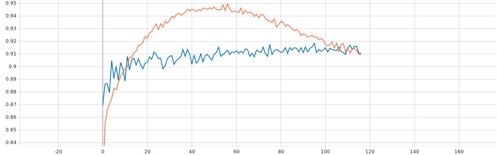
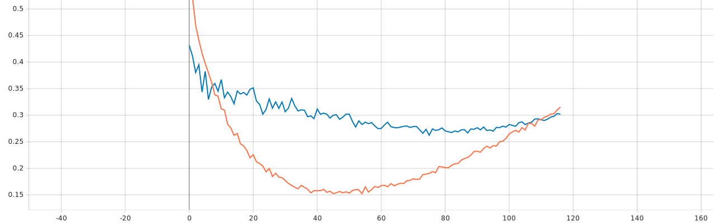
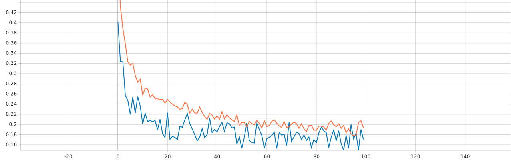
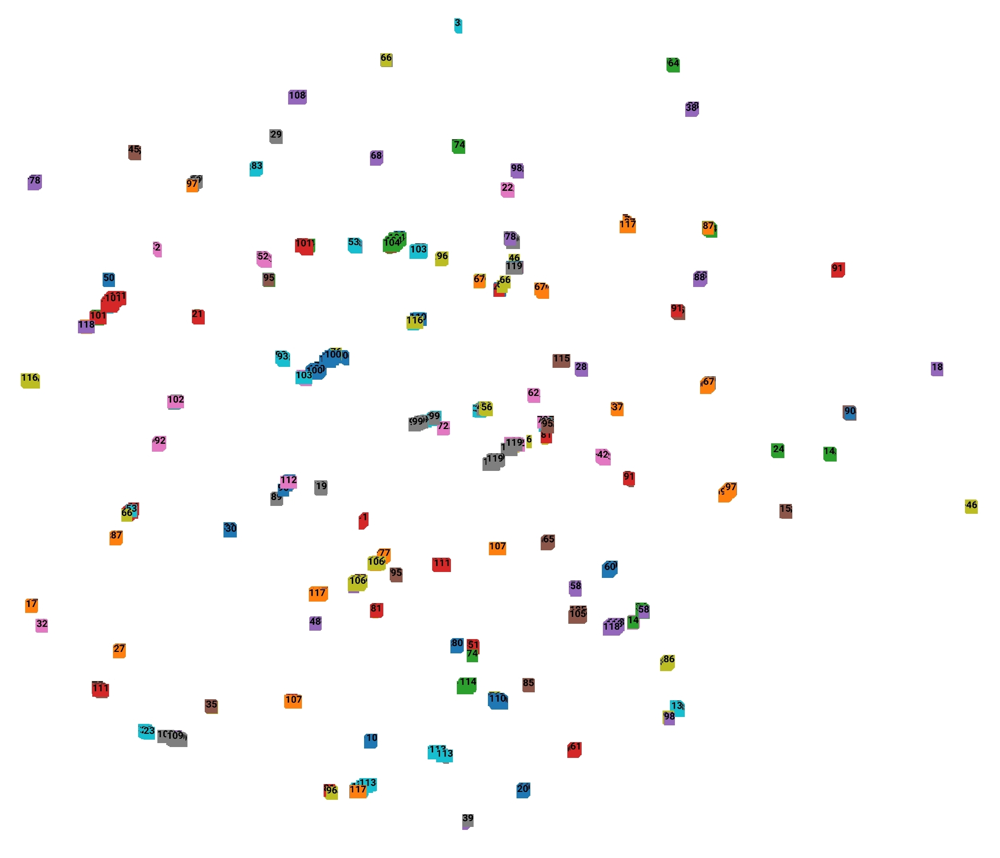
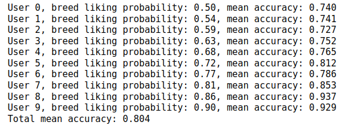

# Artificial Intelligence part of the Psinder project

## Introduction
We aim to extract feature vectors from dog images using Deep Learning network with InceptionResnetv2 as backbone.

Then, using those feature vectors, we will train an ML algorithm to predict user preference, based on his previous binary decisions.

We propose 2 approaches:
- Simple classification network, then extracting the feature vectors from the second to last layer -> **`IncResnetClassify`**
- Network extracting the feature vectors directly, trained using triplet semi-hard loss -> **`IncResnetEmbedNorm`**

| WARNING: To use the trained models it is necessary to download the weights and put them in the **`/out/triplet_best/checkpoints`** or **`out/classification_best/checkpoints`** directory! |
|--------------------------------------------------------------------------------------------------------------------------------------------------------------------------------------------|

Download links:
* [Triplet](https://drive.google.com/drive/folders/1KnOoZllLRCLfZTYyqcQEpWmrJDga4QAH?usp=sharing)
* [Classification](https://drive.google.com/drive/folders/10Lm8mjNqWYRIqGHkA5dBxKTRzABhlSWu?usp=sharing) 


## Module structure
- **`/data`** -> Contains .csv files with information about the train-val-test split and the .mat file with information about the images. Images are not included (see Dataset section of the readme)
- **`/models`** -> Contains files with model architectures for classification and feature vector learning
- **`/notebooks`** -> Contains file for creating the train-val-test split and ML algorithm POC
- **`/out`** -> Contains files with information about the training and model checkpoints
- **`/results`** -> Visualizations from training
- **`config.py`** -> Contains all configurable variables for training and evaluation of the models
- **`unpack_breed_subfolders`** -> Script for unpacking the specific breed subdirectories present in the original dataset
- **`main.py`** -> This is where the training and evaluation happens.

## Dataset
As a dataset we use [Stanford Dogs Dataset](http://vision.stanford.edu/aditya86/ImageNetDogs/).

To prevent from making the repository too bulky, we did not include the images in this repo. 
If needed, download **Images** from the link above and copy all the images to the **data/Images** directory.
In the original datasets the Images are divided into separate breed subdirectories. You can use **`unpack_breed_subfolders.py`** script to unpack them.

Because we did not agree with the way they split the data, we performed our own train-val-test split using the **`split_data.ipynb`** notebook.

The .csv split files are included in this repository but, if necessary, they can be reproduced using the notebook.

The data was split in such way, that the breed distribution would remain balanced.

## Training
To run the training adjust the necessary variables in config.py (the most important is setting the TRAINING to True). Then just run the **`main.py`** file.

## Results
Both experiments used the same data divided into training, validation and test set.

It is possible to visualize the training by running tensorboard on one of the **`out/logs`** directories like this:
```commandline
tensorboard --logdir out/triplet/logs
```

In the graphs we use orange for training and blue for validation.

### Simple classification experiment
#### Accuracy plot:


#### Binary crossentropy loss plot:


Test set results:

```commandline
32/32 [==============================] - 102s 3s/step - loss: 0.2818 - accuracy: 0.9185
```

### Triplet loss experiment
#### Triplet loss plot:

Test set results:

```commandline
32/32 [==============================] - 99s 3s/step - loss: 0.1559
```

#### Visualizations of the feature vectors created from the test set using UMAP
We used [Embedding projector](https://projector.tensorflow.org/) for that with the generated **`vecs.tsv`** and **`meta.tsv`** files in the **`out/logs/triplet_best`** 




## User dog preference prediction using KNN algorithm on the feature vectors
The **`notebooks/dog_preference`** contains a POC demonstration of user dog preference prediction on the synthetic data.

The classification was performed using weighted KNNClassifier(k=3) with k-fold cross-validation repeated 10 times for each fold.

Results on 10 users with different probabilities of liking each dog breed, where training set contains information about only 100 randomly sampled dogs:


