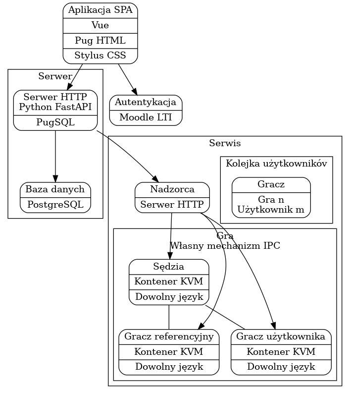

Praca Inżynierska
=================

## Poprzedni system (obecny)

- System rozproszony
  - Php z mysql na jednym serwerze, komunikuje się przez protokół moodlowy LTI (nie ramka)
  - Gry uruchamiane na drugim serwerze. Okresowo pobiera pliki, dodaje do kolejki i zapisuje do bazy wynik gry.
- Użytkownicy skazani na jeden język: Java
- Zabezpieczenia oparte na “zastraszeniu” (napisane o konsekwencjach, czego nie powinno się robić itp)
- Pod spodem wszystko w obrębie jednego procesu java
- Jest security manager
- Interface do moodla to tragedia
- Pod spodem php, mysql, zamiast porządnego zapytania z agregacją jest mnóstwo zapytań do mysql
- Nie ma interfejsu administracyjnego (bylejakie skrypty, skrypt poleceń, tabele w mysql do wyczyszczenia za każdym razem):

## To co zrobimy

- Ma być szybsze

- Większa elastyczność do studentów

- Dla admina (prowadzącego): 

- - Prosty interfejs.
  - Możliwość łatwego zaimplementowania nowej gry: generatora ruchów i weryfikatora. 
  - Łatwość implementacji nowego gracza, możliwość zarządzania graczami referencyjnymi
  - Operacje administracyjne typu: odłączenie studenta od zespołu, wyświetlanie rankingu w obrębie grupy dziekańskiej, zlecenie turnieju w obrębie grupy laboratoryjnej i w obrębie najlepszych z grupy laboratoryjnej, wyświetlanie zwycięzców i punktów.
  - Może jakaś funkcja która na podstawie rozgrywek daje wynik (punkty) użytkownika.
  - Wybór gier udostępnianych studentowi: Pomysł -> baza kilku gier i jedna zmienna, która wskazuje, która gra jest pokazywana dla studentów.
  - Najlepiej dostępny przez moodle (niestety)

- Dla użytkowanika (studenta):

- - Możliwość wgrania więcej niż 1 pliku, ale żeby za dużo nie poszło plików (jakieś zabezpieczenie, np: statystyki linijek kodu (histogram), żeby wykrywać jakieś podejrzane elementy)

- Bezpieczeństwo: 

- - Silna separacja graczy (żeby nie wykradać informacji). 
  - Gracz odseparowany od sędziego. (KONTENERY?)

- Ważne:

- - Nie ma to być platforma ogólnego przeznaczenia. Może mieć ogólne feature’y, ale ma służyć dokładnie do tego zadania: grania w gry z 2 graczami, pełną informacją, gry o sumie zerowej. 
  - Na tej podstawie będzie to oceniane (z tej perspektywy).

- Limity czasowe, ograniczenia:

- - Aspekt kontroli czasu na ruch. (Proste, bo jak nie przyjdzie komunikat, to po tej stronie poszło coś nie tak). 
  - Limit czasu na rozgrywkę, na ruch, czy obydwa?

- Komunikacja:

- - Sędzia i gracze mają być tylko na jednym serwerze. 
  - Nikt nie może zostać zagłodzony i trzeba zadbać o komunikację. 
  - Nie może być komunikacja UDP. 
  - Niezawodna komunikacja z rozsądnymi limitami na czas. 
  - Nie za duży overhead!

- Musi być GUI, gdzie student może sobie poklikać i zagrać w grę:

- - Template htmlowy powinien być stały ale dla różnych schematów sąsiedztwa:

  - - prostokątna plansza, pola kwadratowe
    - hexy

  - Gra może decydować jakiego rodzaju ma planszę.

- Integracja z moodlem: studenci łączą się w grupy.

- - Pod spodem shared secret, Moodle za pomocą tego shared secret przesyła do klienta itp
  - http://www.imsglobal.org/activity/learning-tools-interoperability
  - http://www.dr-chuck.com/ims/php-simple/materials/2010-05-20-blti-php-02.pdf

## Pisanie pracy

- Około 50 stron

## System zarządzania taskami

- Github projects?
- Repo na githubie
- Używamy markdown, latex, nie word/docsy

## Podział zadań

- Linux, konfiguracja środowiska -> Piotr:
  - Mechanizmy wymiany komunikatów w unixie:
    - pipe, named pipe, sockety, shared memory
  - Serializacja danych w pakiecie:
    - Flat buffer, flex buffer
  - Protokoły:
    - Na pewno nie TCP -> w takim razie jaki protokół (binarny)
  - Kontenery:
    - kvm
    - docker (raczej nie)
  - Jak zarządzać zasobami na linuxie
    - Jak procesory poprzydzielać (żeby to było reliable, nikogo nie głodzić, ograniczać przywileje/widoczność systemu plików -> permissions)
- Frontend internetowy (javascript, html, css) -> Maciek
  - Zamiast pisania surowego html'a: pug.js
  - Zamiast czystego CSS: stylus albo sass
  - Zamiast react/angular, vue.js
  - Zamiast webpack, parcel
  - Zamiast axios.js, fetch
- Baza danych i komunikacja ogólnie (backend) -> Sławek
  - Baza danych:
    - Postgresql, ewentualnie Mariadb
	- Polączenie przez PugSQL
  - Api:
    - FastApi do pythona, albo ewentualnie flask.
- Program nadzorca.

## Kiedy się spotykamy

- https://lettucemeet.com/l/zARv6

## Planowy schemat

- https://imgur.com/a/ZkUR0gZ
